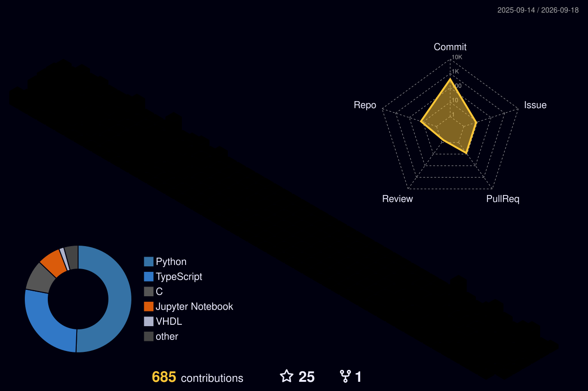

<div align="center">


<a href="https://git.io/typing-svg">
  
</a>

<br/>


<br/><br/>

[](https://www.linkedin.com/in/NimaMakhmali)
[](https://github.com/NimaMakhmali)

</div>


## About

Computer Engineering student focused on backend systems, artificial intelligence, and blockchain. Working with Django and FastAPI, with an interest in algorithms and trading systems.

```python
class Nima:
    def __init__(self):
        self.field = "Computer Engineering"
        self.interests = ["AI", "Blockchain", "Backend Systems"]
        self.stack = ["Django", "FastAPI", "PostgreSQL"]
        self.focus = "Algorithms & Trading Strategies"
```


## Tech Stack

<div align="center">


<br/><br/>


</div>


## GitHub Analytics

<div align="center">


</div>


## Contribution Snake

<div align="center">
  
</div>


## 3D Contribution Graph


